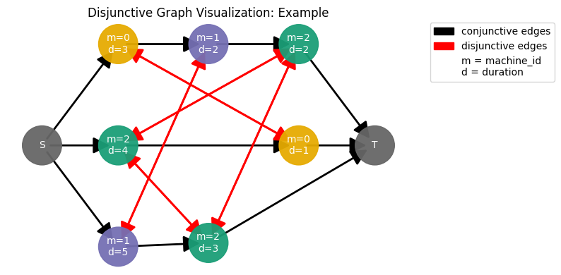

# Solving the Job-Shop Scheduling Problem with Graph Neural Networks


This repository contains everything related to solving the Job-Shop Scheduling Problem (JSSP) with Graph Neural Networks (GNNs). 

> I am currently moving and refactoring part of the code (and adding new functionality) to another repository to create an easy-to-use, modular, and efficient library for the JSSP. See the GitHub repository [here](https://github.com/Pabloo22/job_shop_lib).

The Job-Shop Scheduling Problem (JSSP) is a well-known NP-hard combinatorial optimization problem. It consists of scheduling a set of jobs on a set of machines, where each job is a sequence of operations that must be processed on a set of machines. Each operation has a specific processing time and must be processed in a specific order. The objective is to find a schedule that minimizes the makespan, i.e., the time when all jobs are completed.

This problem is modeled as a graph (as it's shown in the above image), so we can apply GNN based technique to generate new instances (See my [paper](paper.pdf) draft titled "Generating Realistic and Difficult Job Shop Scheduling Problems with a GAN-based Framework for Graph Neural Networks") or to solve the problem (my bachelor's thesis theme). This repository will contain the code for both approaches. Currently, I'm working only on my bachelor's thesis, but some code for the GAN-based approach is already available.

This a very active repository right now, and many changes are done daily, so comprehensive documentation is not yet available. In the future, a step-by-step explanation of the source code of this project will be created in the [Tutorials](notebooks/tutorials). Currently, there is an introductory tutorial.

## Installation

### With Visual Studio Code and Dev Containers
A `.devcontainer` folder in the repository is included. This is set to work with VisualStudio Code and allows to easily work inside a Docker container and avoid specific machines used. This is the safer and most recommended option, especially if you plan to contribute to this repository. For more information about devcontainers click [here](https://code.visualstudio.com/docs/devcontainers/containers).

#### Prerequisites:

1. **Docker Installed:** Ensure Docker is installed on your system. For GPU support, you need the community edition (CE).
2. **NVIDIA GPU Drivers:** Install the latest NVIDIA drivers for your GPU from the official website.
3. **NVIDIA Docker Toolkit:** Install the NVIDIA Container Toolkit, which allows Docker to use the GPU.


### With Poetry
Another option is to use [Poetry](https://python-poetry.org/) directly in your own machine, which is a tool for dependency management and packaging in Python. It helps to create and manage virtual environments, streamlining the process of setting up and maintaining project dependencies. Poetry automatically handles dependency resolution and ensures that your project environment is consistent. This option is recommended if you are using Windows.

#### Prerequisites:
- **Python 3.11.6**: Although it is possible that older Python versions work as well, currently available code has only been tested with Python 3.11.6.
- **Graphviz** (optional): In order to plot the disjunctive graph of a `JobShopInstance` with the default layout you will need to have [PyGraphviz](https://pygraphviz.github.io/documentation/stable/install.html) and its dependencies.

## Project Structure
The project structure is based on the [Cookiecutter Data Science](https://drivendata.github.io/cookiecutter-data-science/) template. This template provides a standardized structure for organizing data science projects. Only minor modifications of this template has been made.

```python
|-- LICENSE
|-- Makefile            # Makefile with commands.
|-- README.md
|-- data
|   |-- README.md
|   |-- instances.json  # Json file with metadata of each instance.
|   `-- raw             # Orginal JSSP instances in Taillard form.
|       |-- abz5        # These files have no extension.
|       | ...
|       `-- yn4
|-- scripts             # Scripts for creating datasets, training models, etc.
|-- gnn_scheduler       # Source code for use in this project.
|   |-- __init__.py
|   |-- gan             # Generative Adversarial Network project related source code.
|   |-- job_shop        # Job Shop Scheduling related source code.
|   `-- training_utils  # Training related source code.
|-- notebooks           # Jupyter notebooks.
|   |-- data_exploration
|   `-- tutorial
|-- poetry.lock         # Dependency versions lock file.
|-- pyproject.toml      # Project and dependency configuration.
`-- tests               # Test scripts and unit tests for the project.
```


